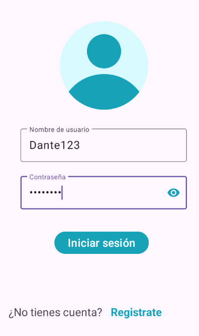
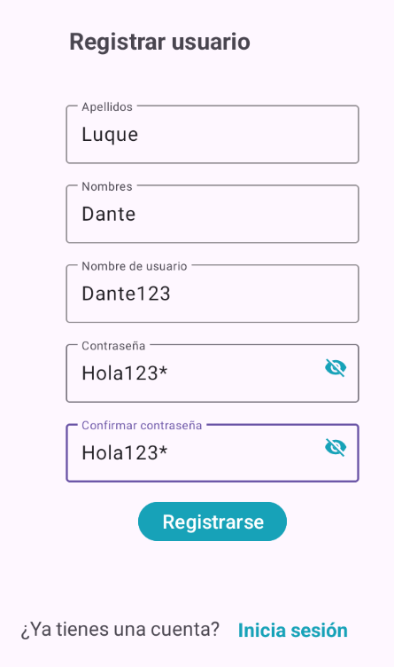
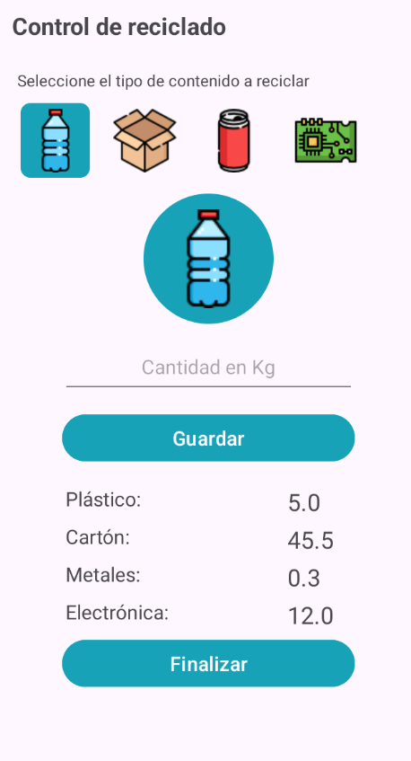

### Actualizacion de la UI

Ahora los campos poseen la ui generada por la libreria `Material Components` de Android, proporcionando un estilo moderno y la capacidad de mostrar contenido en campos que ocultan el texto como los de tipo password.

